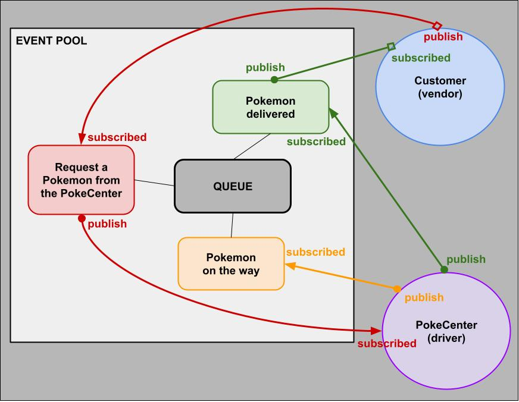

# LAB - Class 14

> ## Project: Event Driven Application

### Authors: Abdinasir Yussuf and Andrew Schiller

> ### Problem Domain

Create a Event Driven application:

- We utilized the Pokemon API to deliver Pokemon to our beloved customers.

> ### Links and Resources

- [Pokemon API](https://pokeapi.co)

> ### Setup

`.env` requirements (where applicable)

> ### How to initialize/run your application (where applicable)

`node server.js`: within the `/server` folder

`node index.js`: within `/Driver` folder

`node index.js`: within the `/Vendor` folder

> ### How to use your library (where applicable)

> ### Features

- Use Pokemon API to deliver a Pokemon out of 150 choices.

> #### UML

